# 인바디 Kiosk 웹앱
> 보안상 코드는 업로드가 불가하여, 이미지로 대체.
---

- ### 목차

**[1. 프로젝트 정보](#1-프로젝트-정보)**

**[2. 주요기능 및 스크린샷](#2-주요기능-및-스크린샷)**

---

## 1. 프로젝트 정보

**프로젝트기간** **:**
- 2021.09 ~ 2021.11 

**팀 구성원** **:**
- 총 2명
  - Front-end : 1명 ( 웹뷰 )
  - Back-end & Server : 1명

**사용 언어 및 툴** **:** 
- HTML
- CSS
- Vanilla JS
- html qr reader library
- Visual Studio

**목적** **:** 
- 인바디 미국 법인 요청으로 진행하게 된 프로젝트.
- 키오스크 웹앱은 아이패드 전용으로 제작.
- 본인이 원하는 장소와 시간에 인바디 측정이 가능하도록 함.
  - 병원이나 헬스장 방문, 혹은 가정집 인바디 장비가 필수가 아님.
  - 인바디 장비와 키오스크 계정(인바디 계정)을 소유하고 있는 주변 약국이나 어느 곳이든 측정이 가능. 

## 2. 주요기능 및 스크린샷
## 키오스크 앱 UI설정용 관리자 사이트
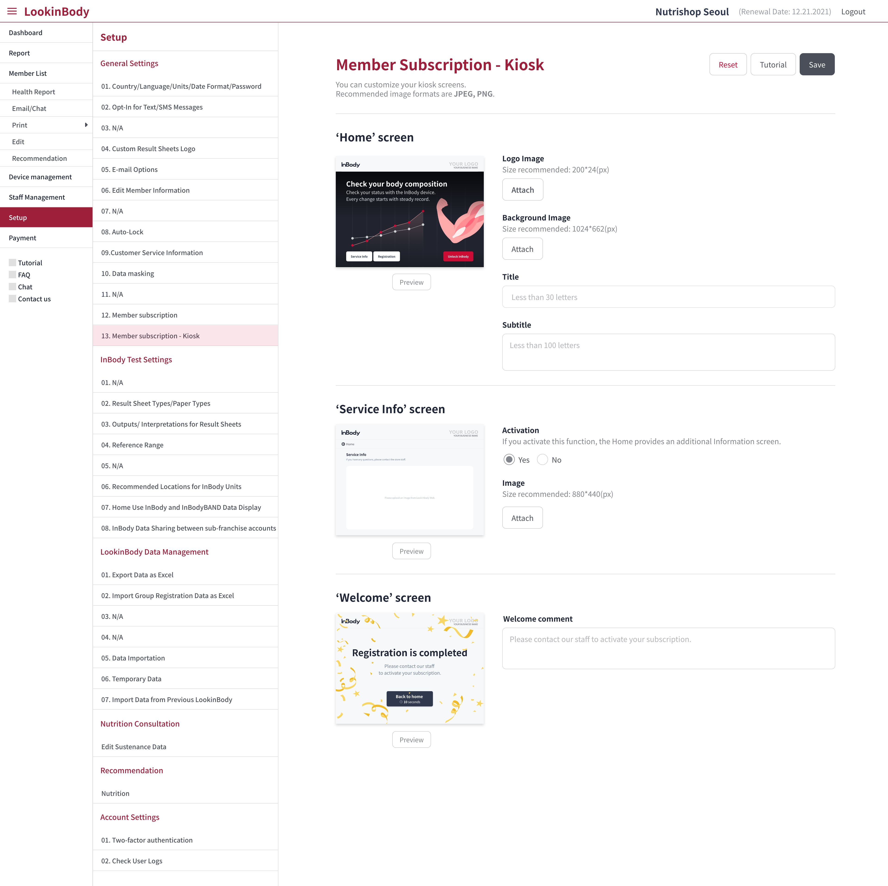

> 인바디 Admin계정에서만 설정을 볼 수 있음 ( 일반 회원 계정은 볼 수 없음 ) 
> 앱 첫 화면, 광고 화면, 환영 화면에서 로고 이미지, 배경 이미지, 문구 추가 및 수정이 가능

---
## 첫 화면
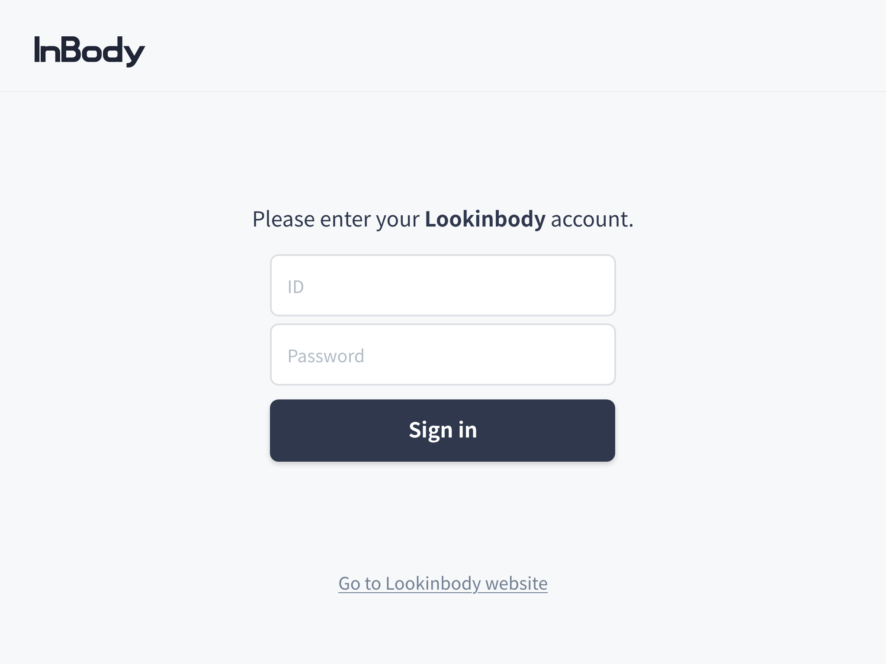

> 로그인 및 처음 화면

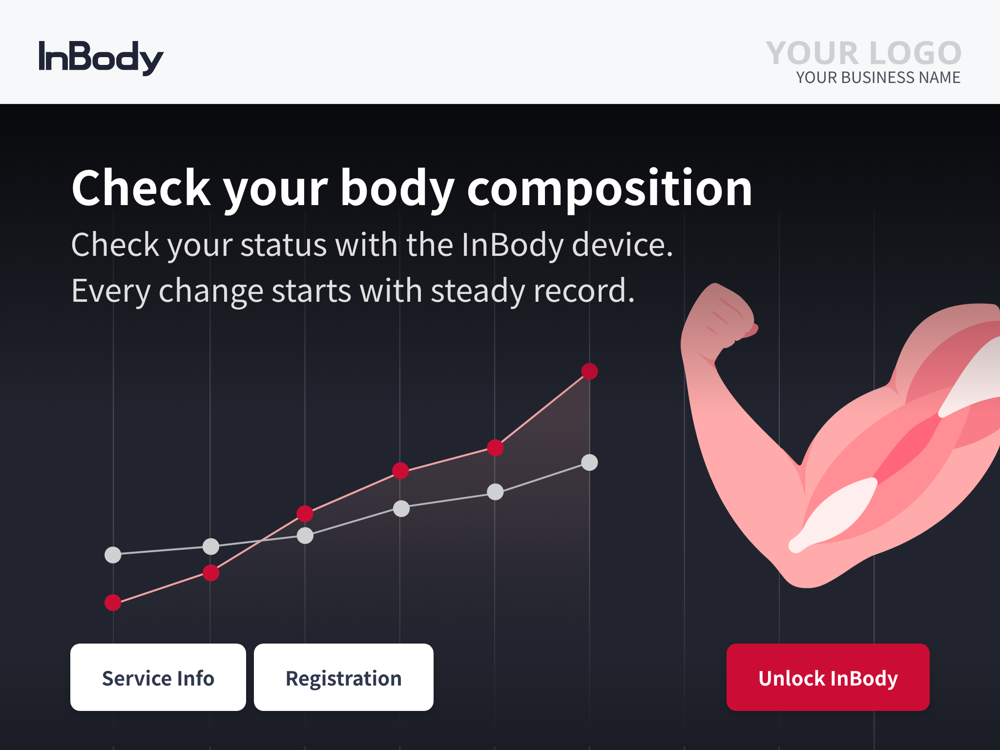

> 관리자 사이트에서 설정한 사용처 로고, 배경 이미지, service info의 활성화 상태를 불러와 적용 후 보여준다 
> 앱 사용이 처음이라면 Registration을 통해 회원 가입을 진행 후 사용하면 된다. 
> 회원이라면 Unlock InBody를 통해 바로 인바디 검사를 진행하면 된다.

---
## Registration & Verification
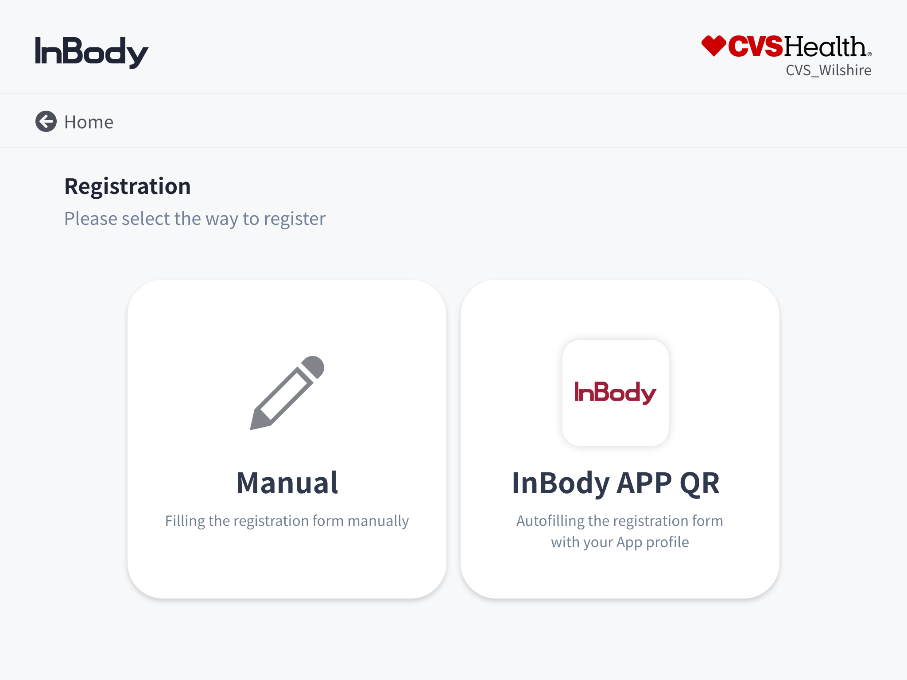

> Manual 버튼을 누르면 본인이 직접 사용자 정보를 입력해야 함.

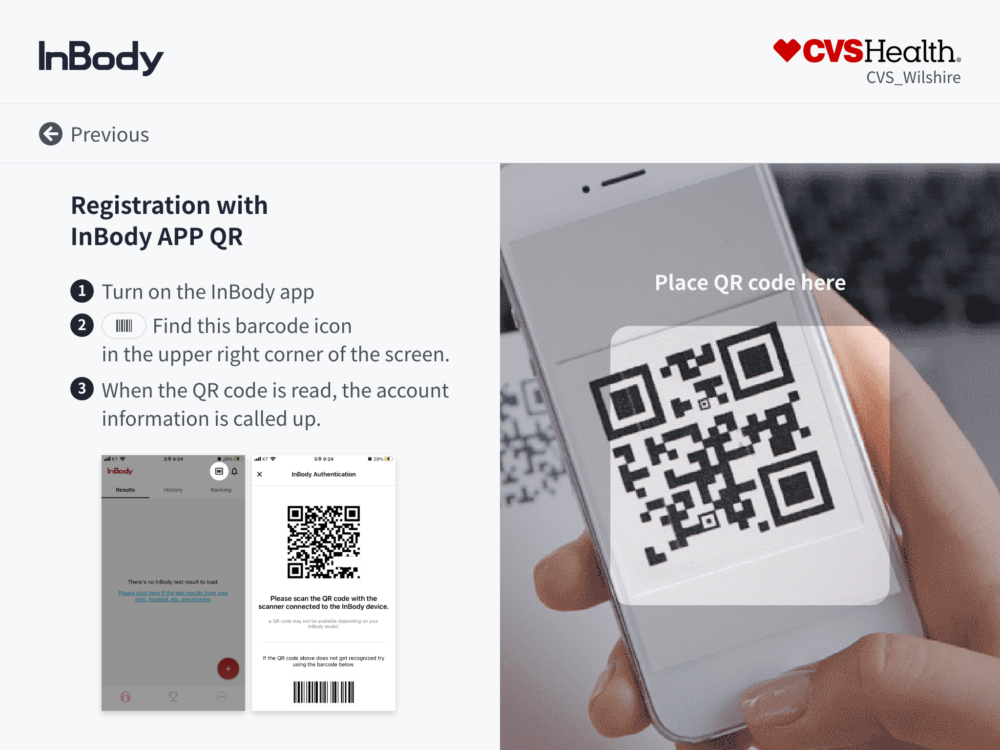

> InBody App QR 리더를 통해 인바디 계정에 등록되어 있는 본인 정보를 가져올 수 있음. 
> 가져온 정보는 자동으로 입력 됨. 
> *첫 개발 시 html qr 라이브러리를 사용했지만, 아이패드에서 정상적으로 동작하지 않는 이슈가 지속적으로 발생하여 QR리더 부분만 IOS에서 따로 개발.

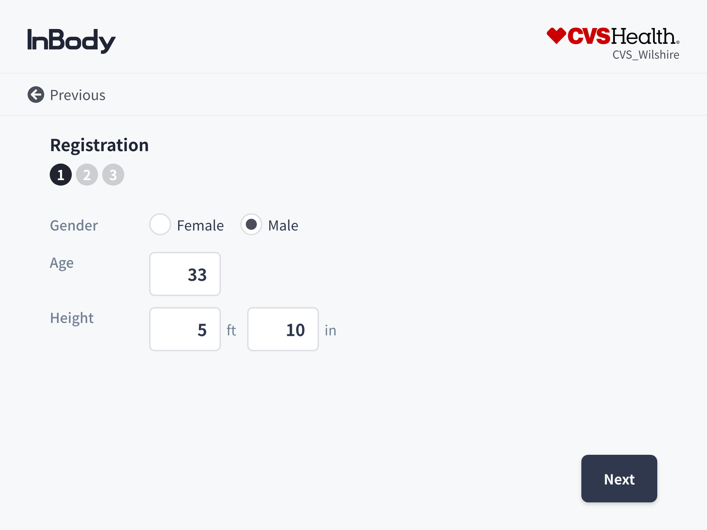
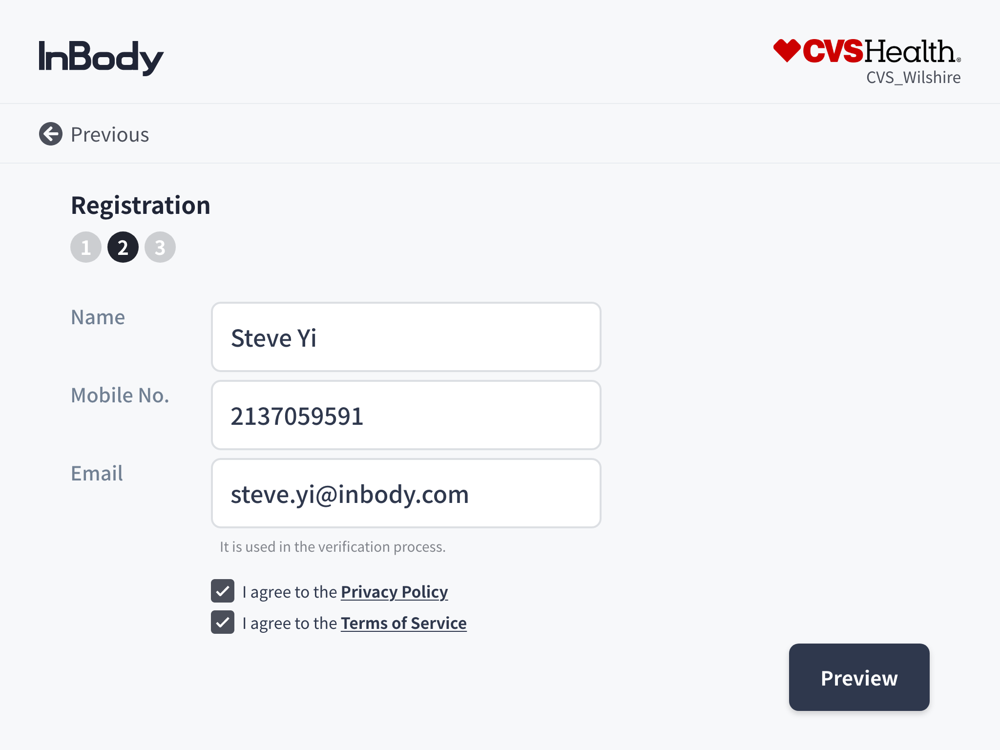
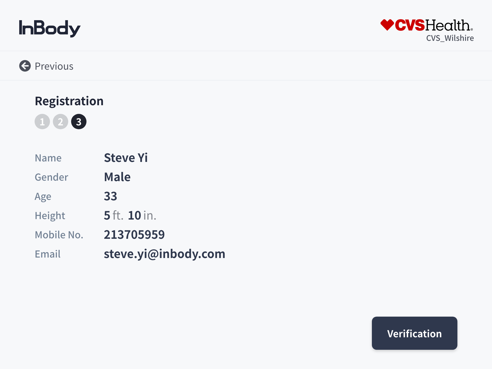
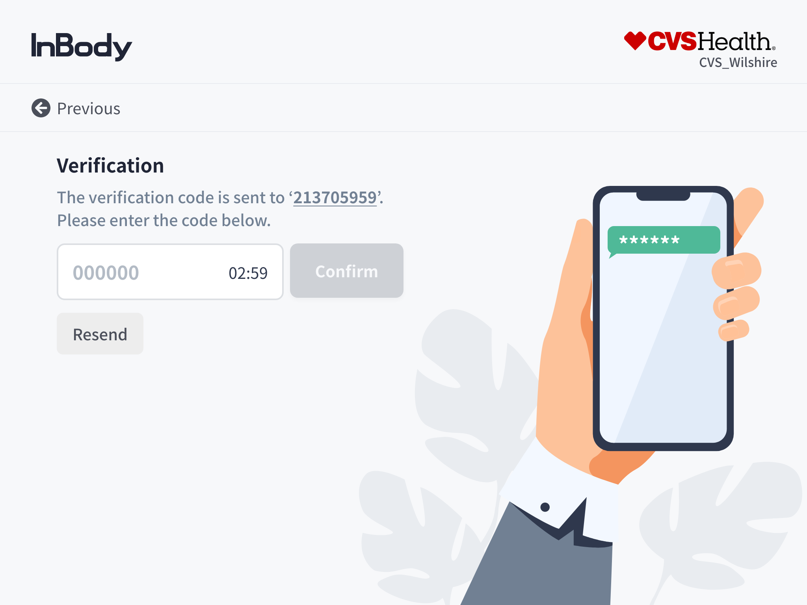

> 사용자 정보 입력 후 Verification을 통해 본인 인증 필요.

---
## Unlock Test
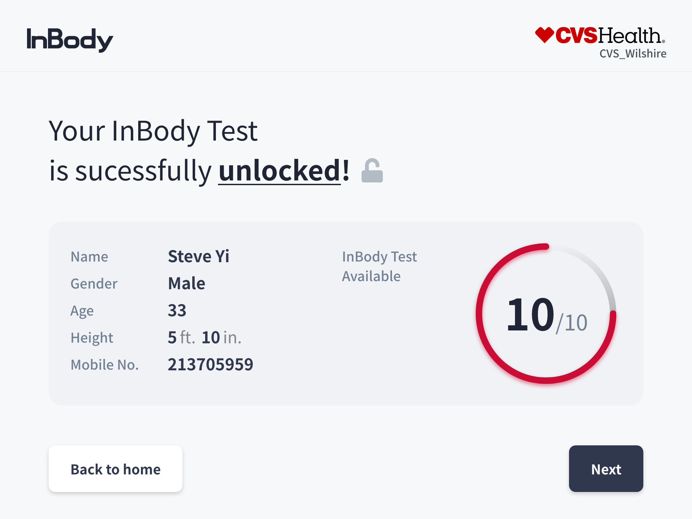

> 본인이 검사할 수 있는 총 횟수와 현재 검사 가능한 횟수를 보여줌. 
> 서버와 장비 통신으로 관리자 사이트에 설정한 총 횟수와, 장비 사용 시 차감 후 남은 현재 횟수로 데이터를 보여줌.

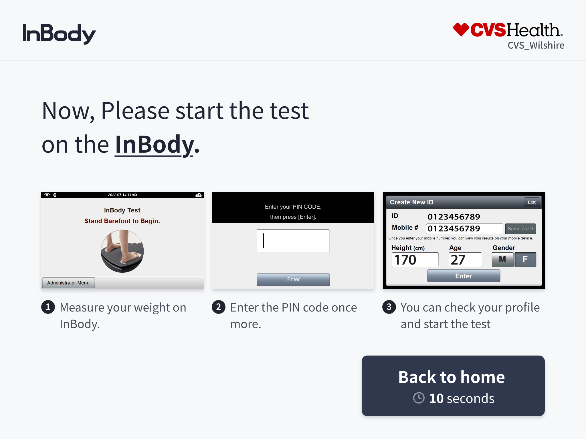

